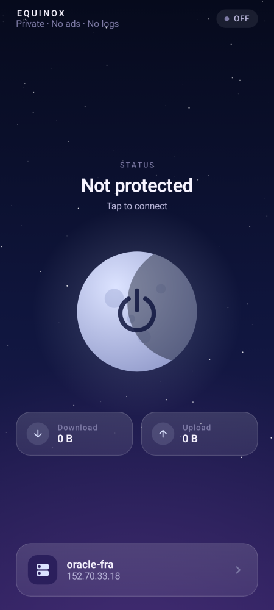
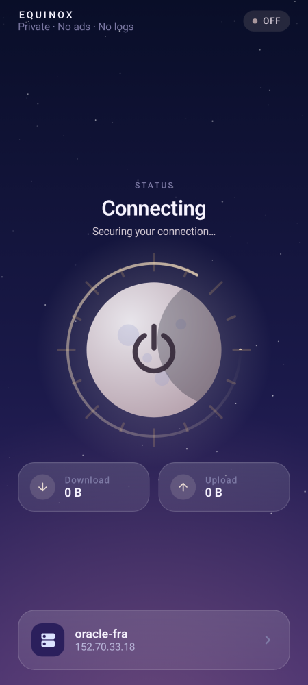
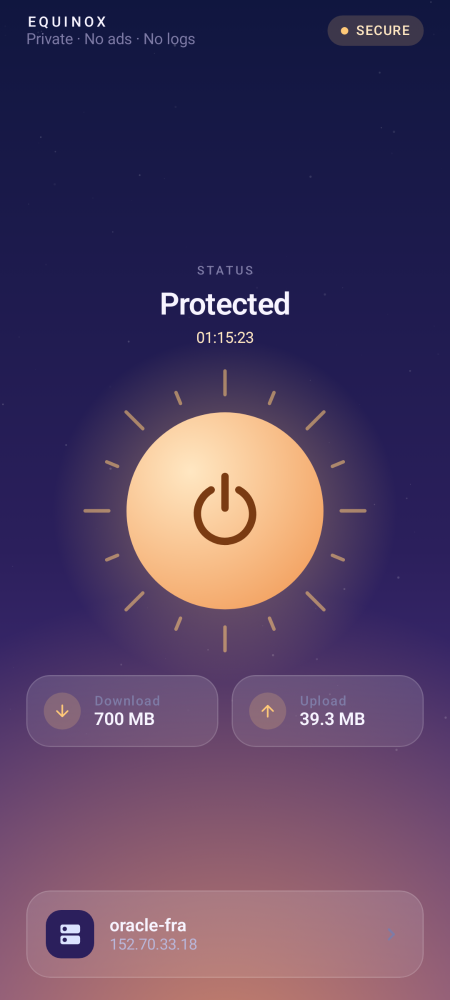

# Equinox VPN

A personal VPN app for Android with **no ads, no tracking and no accounts**. It connects only to **your own** server.

| Night (off) | Connecting | Day (protected) |
|---|---|---|
|  |  |  |

- **One theme that blends night and day:** a night sky with a moon while you're unprotected, which turns into a sunrise and a sun once you connect.
- English only, one main screen, one button.
- Built on the official **WireGuard** engine (fast, modern, low battery use).
- Add a server by **QR code**, a `.conf` file, or by pasting the config text.

---

## Why can't it run on Vercel?

Vercel only hosts websites and short functions that run for a few seconds. A VPN server needs:
a machine that runs all the time + UDP traffic + root network access. Vercel provides none of these.
The free alternative that does work is **Oracle Cloud Always Free** (a real server, free with no time limit).

---

## Step 1: Get a free server (once)

1. Create an account at [Oracle Cloud Free Tier](https://www.oracle.com/cloud/free/). It asks for a card to verify your identity, but **Always Free** resources are never charged.
2. **Create a VM instance** → Image: **Ubuntu 22.04/24.04** → Shape: `VM.Standard.E2.1.Micro` or `Ampere A1` (both free).
3. Open the VPN port: **Networking → Virtual Cloud Networks → your VCN → Security Lists → Default → Add Ingress Rule**
   - Source CIDR: `0.0.0.0/0` — IP Protocol: **UDP** — Destination Port: **51820**

> Any other server works too (Hetzner, DigitalOcean, a computer at home…). It just needs Ubuntu or Debian.

## Step 2: Install the VPN on the server (one command)

Connect to the server over SSH, then run:

```bash
curl -fsSL https://raw.githubusercontent.com/hamid-tlailia/Vpn/main/server/setup.sh -o setup.sh
sudo bash setup.sh
```

A **QR code** appears in the terminal. Keep it open.

- Add another device: `sudo bash setup.sh add laptop`
- Show a device's QR code again: `sudo bash setup.sh show phone`

## Step 3: Install the app

**Option A: no Android Studio needed.** Every push to GitHub builds the APK automatically:
`Actions` tab → latest **Build APK** run → download **Equinox-apk** → install it on your phone.
(To publish a permanent download link: create a tag such as `v1.0`, and the APK appears under **Releases**.)

**Option B:** open the project in Android Studio and press ▶ Run.

## Step 4: Connect

Open Equinox → tap the server card at the bottom → **Scan QR** → scan the code from step 2 → tap the moon 🌙 → ☀️

---

## Optional: stable updates

Without this step, every build is signed with a different key, so you have to uninstall the old version before installing a new one.
To install updates directly over the existing app, create a key once:

```bash
keytool -genkeypair -v -keystore equinox.jks -alias equinox -keyalg RSA -keysize 4096 -validity 36500
base64 -w0 equinox.jks   # copy the output
```

Then under **Settings → Secrets and variables → Actions**, add:
`KEYSTORE_BASE64` (the copied text) and `KEYSTORE_PASSWORD` (the password).

---

## Project layout

```
app/                     Android app (Kotlin + Jetpack Compose)
  data/ProfileStore.kt   Saved servers (.conf files in private app storage)
  vpn/VpnController.kt   WireGuard tunnel control
  ui/                    Screens + the sky/sun-moon design
server/setup.sh          Turns an Ubuntu/Debian server into your WireGuard server
.github/workflows/       Builds the APK automatically
```

Privacy: the app contains no analytics, no ads, and makes no network requests other than the tunnel itself.
